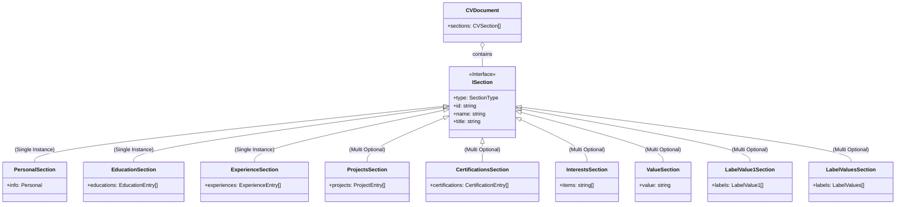
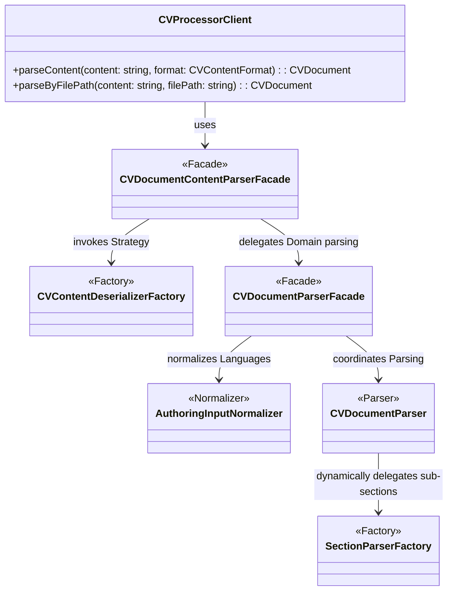
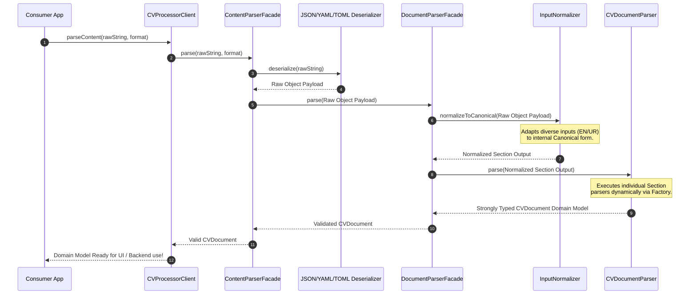

<div align="center">
  <br />
  
  <h1>CV Processor 🚀</h1>
  <p><b>A modern, robust, and multi-lingual Curriculum Vitae (CV) Parsing Library</b></p>

  <p>
    
    
    
    
    
  </p>

  <p>
    <a href="https://www.buymeacoffee.com/shamilkhan" target="_blank">
      
    </a>
    <a href="https://ko-fi.com/shamilkhan" target="_blank">
      
    </a>
  </p>
</div>

<br />

## 📖 Summary

**CV Processor** is a lightweight, highly flexible TypeScript library designed to seamlessly parse user-friendly CV data structures written in `JSON`, `YAML`, or `TOML`. It elegantly converts unstructured or raw curriculum vitae data into strictly typed domain models. You can easily integrate it into any backend service or frontend web application to build dynamic UIs, generate stylish PDF/Docx output, or power an entire CV management system.

It features robust error-handling, internal dependency injection, built-in multi-language format support (e.g., English, Urdu), and blazing-fast execution.

---

## 🛠 Tech Stack

| Technology | Purpose | Link / Logo |
| :--- | :--- | :--- |
| **TypeScript** | Core Language (Strict Typing) |  |
| **Node.js** | Runtime Environment |  |
| **pnpm** | Lightning Fast Package Manager |  |
| **Vitest** | Next Generation Testing Framework |  |
| **YAML / TOML** | Beautiful serialization formats |  |

_Under the hood: Powered by **Awilix** (Dependency Injection) and **Pino** (High-performance Logging)._

---

## ✨ Features Details

* **Universal Formats Supported:** Read your data interchangeably from `JSON`, `YAML/YML`, and `TOML`.
* **Multi-Language Parsing:** Fully supports multiple regional languages natively out of the box (e.g., CV data structures stored in `EN` or `UR`).
* **Clean API Wrapper:** Abstracts all complex Container, Dependency Injection, and Logger configurations away from the developer through a unified `CVProcessorClient`.
* **Frontend & Backend Agnostic:** Easily consume raw strings obtained through REST-API endpoints globally (`globalThis.fetch`) or stream files directly from a backend UNIX filesystem (`fs.readFileSync`).

---

## 🏛 Architecture & Engineering

The library was crafted with strong software engineering fundamentals to ensure scalability, ease of testing, and long-term maintainability.

### Principles & Patterns Applied
* **SOLID Principles**: Responsibilities are heavily segregated. Parsers strictly parse, normalizers adapt languages, and the core facade coordinates safely (SRP & OCP).
* **GoF Design Patterns**:
  * **Facade**: `CVDocumentContentParserFacade` hides complex sub-systems from consumers.
  * **Factory**: Used extensively (`SectionParserFactory`, `CVContentDeserializerFactory`) to abstract complex object creation contexts.
  * **Strategy**: Deserializers (`JSON`, `YAML`, `TOML`) encapsulate format-specific algorithms securely.
  * **Decorator**: Intercepts logger flows to append scoped metadata uniformly.
* **Dependency Injection**: Architected tightly with **Awilix** to decouple modules, drastically improving unit testability via mocking.
* **Structured Logging**: Leveraging **Pino** isolated in sub-modules to capture event traces locally without bleeding logs out dynamically to the consumer.

### 🌟 The Highlight: True Multi-Language & Future AI Translation
A core identity of **CV Processor** is its robust support for diverse regional languages natively (like English `EN` or Urdu `UR`). Our domain model is explicitly typed to effortlessly adapt to multiple languages by normalizing payloads down to a canonical internal format. 

**What's Next (Roadmap) 🔮**: We will soon be integrating an AI processing engine designed to **auto-translate** user-provided raw CV data. This means a user could upload their CV once in any local language, and the framework will autonomously transpile it across various locales instantly!

---

### Domain Object Model (UML)
The domain layer is exactly what the end-user operates on. We've structured the types so developers receive a rigorous, highly-typed model `CVDocument`. 

> **Important Constraint**: The `Personal`, `Education`, and `Experience` sections are strictly **single-instance per document**, while all other primitive sections (like `Project`, `Value`, `LabelValues`) are completely optional and can be instantiated as many times as you like globally!



### System Parsing Class Hierarchy (UML)
This is our strict architectural pipeline that powers the creation of the pure domain model above.



### Event flow (Parsing Execution)



---

## 💻 Setup & Installation

If you would like to run this repository locally, test it, or hack on it:

```bash
# 1. Clone the repository
git clone https://github.com/your-username/cv-processor.git
cd cv-processor

# 2. Install dependencies securely (Uses pnpm)
pnpm install

# 3. Build the Dist code
pnpm run build

# 4. Review everything works fine locally
pnpm test
```

> **Note:** We use `pnpm` exclusively via the `packageManager` field inside `package.json`. Make sure you have it installed globally via `npm install -g pnpm`.

---

## 🔌 Usage Examples

### 1. Backend Service (Node.js/Express snippet)
Parse local filesystem configurations or incoming HTTP POST buffers strictly via the simple exposed API Client.

```typescript
import { createCVProcessor, type CVContentFormat } from 'cv-processor';

// Fetch your content safely (from DB or Node JS API)
const rawYamlData = `
personal-section:
  name: "John Doe"
  titles: ["Senior Engineer"]
`;

// Creates the API singleton gracefully handled over AWILIX
const processor = createCVProcessor();

try {
  // Pass content and identify the format
  const cvDocument = processor.parseContent(rawYamlData, 'yaml' as CVContentFormat);
  
  console.log('Parsed successfully:', cvDocument.sections.length, 'sections found.');
} catch (error) {
  console.error('Validation or Parsing failed:', error);
}
```

### 2. Frontend web application (React Component)
Need to populate a dynamic dashboard? You can use fetch commands in your React Native / React Web projects.

```tsx
import React, { useEffect, useState } from 'react';
import { createCVProcessor, type CVDocument } from 'cv-processor';

export const CVViewer: React.FC<{ url: string }> = ({ url }) => {
  const [cvDoc, setCvDoc] = useState<CVDocument | null>(null);
  const [error, setError] = useState<string>('');

  useEffect(() => {
    const fetchAndParse = async () => {
      try {
        const response = await fetch(url);
        if (!response.ok) throw new Error("HTTP Status Error");
        
        const rawContent = await response.text();
        
        // Ensure you create the processor locally when treating raw responses.
        const processor = createCVProcessor();
        const document = processor.parseContent(rawContent, 'json');
        
        setCvDoc(document);
      } catch (err) {
        setError(err instanceof Error ? err.message : 'Unknown error');
      }
    };

    fetchAndParse();
  }, [url]);

  if (error) return <p className="text-red-500">Error: {error}</p>;
  if (!cvDoc) return <p>Loading CV Skeleton...</p>;

  return (
    <div className="cv-dashboard">
      <h1>Resume Details</h1>
      <ul>
        {cvDoc.sections.map((section, idx) => (
          <li key={idx}>Section Registered: {section.type}</li>
        ))}
      </ul>
    </div>
  );
};
```

---

## 🤝 Forking & Contributing

We welcome community collaborations to make this even better! If you’d like to jump in:

| Step | Instruction |
| :---: | :--- |
| **1.** | **Fork** the repository by clicking the `Fork` button at the top right of the repo. |
| **2.** | Create your new topic branch `git checkout -b fix/new-feature` |
| **3.** | Run `pnpm run dev` to interact with `./index.ts` playground while programming. |
| **4.** | Run `pnpm run lint` && `pnpm test` to ensure stability and code standards. |
| **5.** | Commit your changes using descriptive commit messages and open a **Pull Request**. |

Please ensure any new formats or API usages you add include their respective `.test.ts` suites under the `./tests` directory. 

---

## 💖 Sponsor & Support

If you find **CV Processor** helpful, please consider supporting its ongoing development! Writing and maintaining an open-source library takes time, and your sponsorships keep the coffee flowing and the commits coming. 😊

<p>
  <a href="https://www.buymeacoffee.com/shamilkhan" target="_blank">
    
  </a>
  &nbsp;&nbsp;&nbsp;
  <a href="https://ko-fi.com/shamilkhan" target="_blank">
    
  </a>
</p>

---

## 📜 License

This project is open-source and registered under the **[GNU License](./LICENSE)**. You are free to change, distribute, or run the usage scripts privately under its compliance guidelines.

---

<br/>
<div align="center">
  <sub>Built with ❤️ by <b>Shamil Khan</b></sub>
  <br/>
  <sup>© 2026 Shamil Khan. All Rights Reserved.</sup>
</div>
